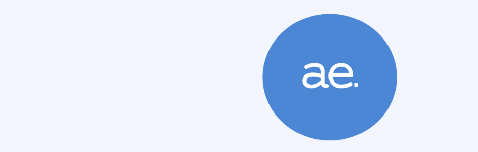

# Organizae

Projeto integrador para avaliação dos conteúdos passados até agora (UC5, UC2, UC6 e UC7) pela professora Edna no curso Aprendizagem Profissional de Qualificação em Desenvolvimento de Softwares, turma 567.

